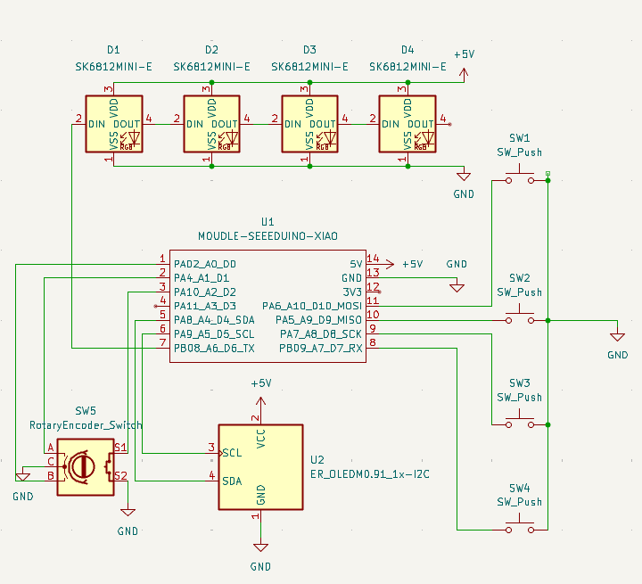

# HenryWau's BludPad

* Keyboard Maintainer: [Henry Wauzivuff](https://github.com/heofottoman)

This is my very first macropad made for Hackpad. I designed it to be optimised for my little desk :>

A screenshot of your overall hackpad
A screenshot of your schematic
A screenshot of your PCB
A screenshot of your case and how it'll fit together
a BOM for your parts

## Specifications
### BOM
- 1x Seeed Xiao RP4020
- 1x EC11 Rotary Encoder
- 4x Cherry MX switches
- 4x Blank Keycaps
- 4x SK6812 MINI-E LEDs
- 4x Screws

### Others
- Custom PCB
- QMK Firmware
- Case.STL

#### Schematic
 
https://cdn.hackclub.com/019d466b-ad1f-7994-9d12-ee104b858810/image.png

#### PCB
|  

#### Case
| 

## References

